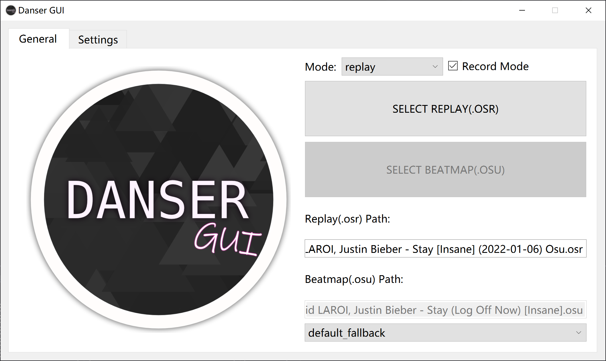
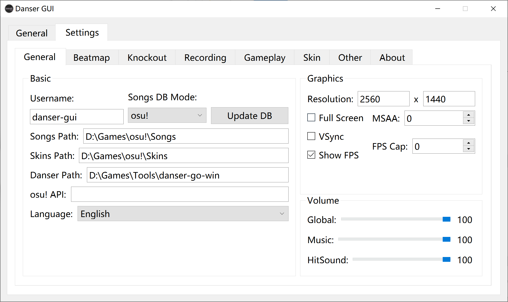
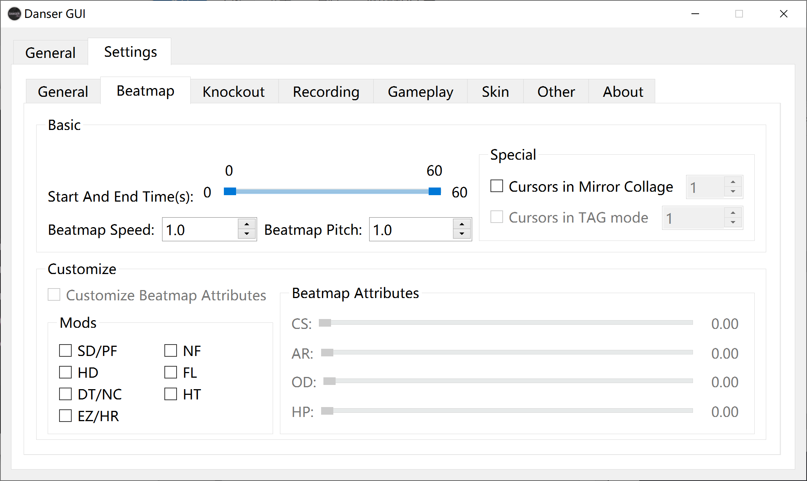
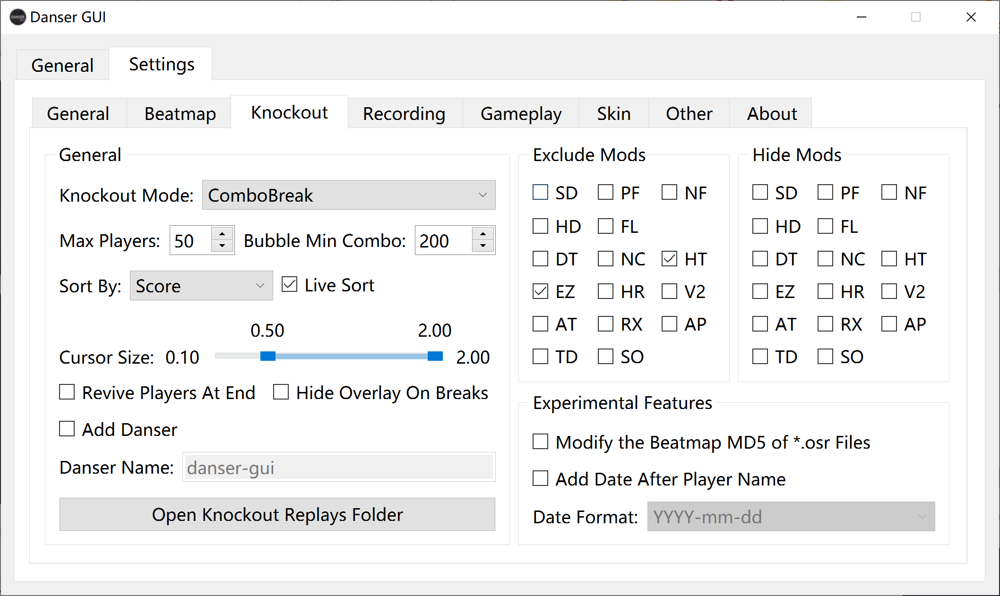
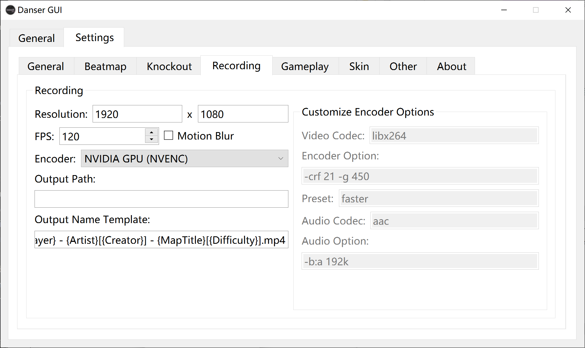
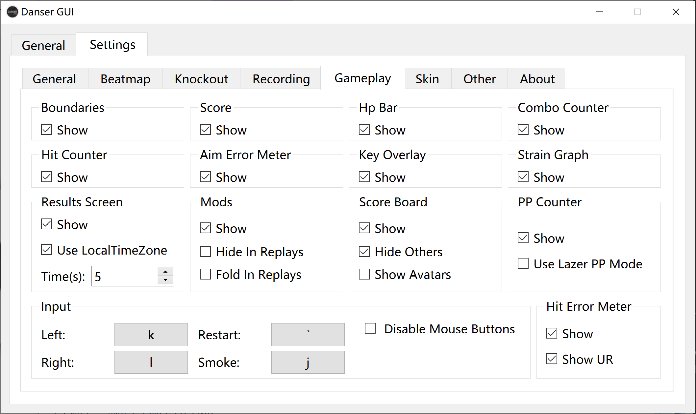
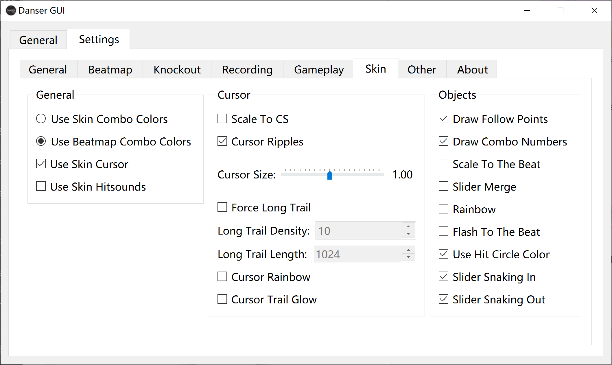
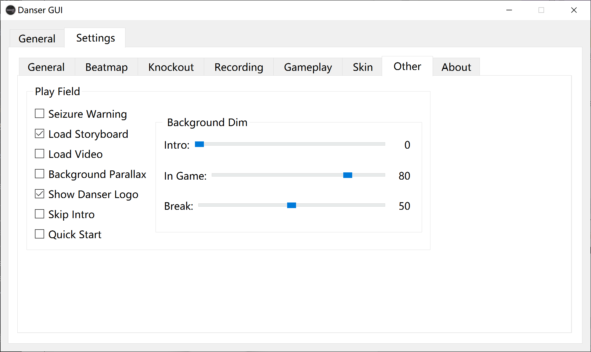
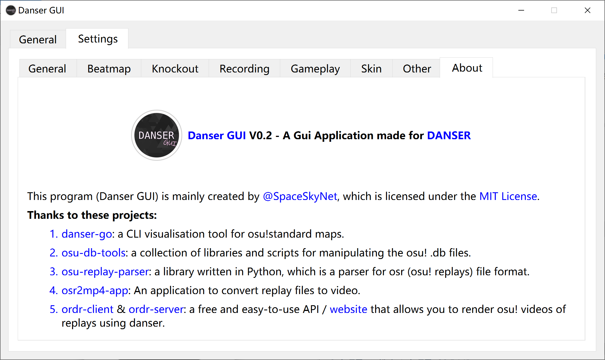

  

# Danser GUI

<h2 align="center">A Gui Application made for <a href="https://github.com/Wieku/danser-go">DANSER</a>

[中文说明](README-zh.md)

## How to Install Danser GUI

1. Go to the latest release page [HERE](https://github.com/spaceskynet/danser-gui/releases/latest)
2. Download the right file base on your system arch.
3. Extract it and put it where you want.
4. Run `DanserGUI.exe` in Windows or `./DanserGUI` in Linux Terminal.
5. Change the configuration and click the `Danser GUI` icon to start!

Read [WIKI (unfinished)](https://github.com/spaceskynet/danser-gui/wiki) for more information.

## A Few Points to Pay Attention !!

1. If you don't have danser already, you can follow [THIS SETUP GUIDE](https://github.com/Wieku/danser-go/wiki/Setup-Guide) to get started! (only steps 1 and 2).
2. If you want to use the `Record Mode`, please make sure that `ffmpeg` is installed globally or put in danser folder (or in the ffmpeg folder of the danser folder). You can find ffmpeg [HERE](https://github.com/BtbN/FFmpeg-Builds/releases/), and you can follow [THIS FFMPEG SETUP GUIDE](https://github.com/Wieku/danser-go/wiki/FFmpeg) to install ffmpeg.
3. If you already have osu!, the beatmap database mode is best to choose `osu!` mode, if you only have `Skins` and `Songs` directory, please choose `danser` mode.
4. If you want to use osu! default skin as the fallback skin, please download the [default_fallback](https://github.com/spaceskynet/git-cloud/blob/master/osu!/Skins/default_fallback.osk) skin and extract it to your `Skins` folder.
5. This program is still in beta, if you want to get more information, you can enter `debug` mode with the `-d` or `-debug` flag.
6. This program just configure a few settings in danser, if you want edit more settings, please edit the danser json settings file directly.
7. `Knockout` mode is ~~still in the process of being perfected~~ basically works.

## Interface Preview

Interface Preview

## How to Contribute Translations

1. Use `pip install pyqt5-tools` to install `pylupdate5`, and you can download Qt Linguist in [this page](https://download.qt.io/linguist_releases/) on Windows or install it from your package manager on Linux.
2. Clone this repository and go to the `src` folder. Add your language tag `xx-xx` into the `langs` list in `generate_ts.sh` or `generate_ts.bat`, then run the correct script. (Like `langs=(en-US zh-CN xx-xx)` or `set langs=en-US zh-CN xx-xx`)
3. You can find `xx-xx` in the `langs` folder, then use the Qt Linguist to open the `lang.ts` in `langs/xx-xx` folder and you can translate it! Don't forget to change the language name in `lang.txt`.
4. After translation, you can pull request on this repository!

## Credits

This program (Danser GUI) is mainly created by [@SpaceSkyNet](https://github.com/spaceskynet), which is licensed under the [MIT License](./LICENSE). If you support this project, you can become a stargazer by clicking the star in the upper right corner of this [page](https://github.com/spaceskynet/danser-gui/). It must be awesome!

**Thanks to These Projects:**

1. [danser-go](https://github.com/Wieku/danser-go): a CLI visualisation tool for osu!standard maps.
2. [osu-db-tools](https://github.com/jaasonw/osu-db-tools): a collection of libraries and scripts for manipulating the osu! .db files.
3. [osu-replay-parser](https://github.com/kszlim/osu-replay-parser): a library written in Python, which is a parser for osr (osu! replays) file format.
4. [osr2mp4-app](https://github.com/uyitroa/osr2mp4-app): An application to convert replay files to video.
5. [ordr-client](https://github.com/MasterIO02/ordr-client) & [ordr-server](https://github.com/MasterIO02/ordr-server): a free and easy-to-use API / [website](https://ordr.issou.best/) that allows you to render osu! videos of replays using danser.